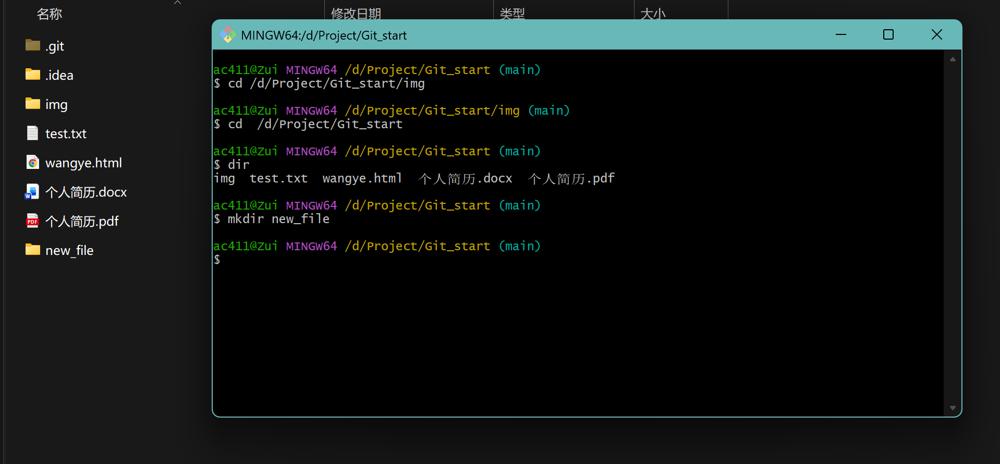

# 考核任务仓库
---
<h3>1.环境准备</h3>

Ai编程工具使用：Deepseek Harness(部分使用Codex）

代码编辑器使用：WebStorm（部分使用CLion）

<h3>2.个人简介</h3>

PDF文件版：<a href=https://github.com/Z-U-I-S/beginning/blob/main/%E4%B8%AA%E4%BA%BA%E7%AE%80%E5%8E%86.pdf>个人简介</a>

个人网站：<a href=https://github.com/Z-U-I-S/beginning/blob/main/>个人网站</a>

<h3>3.通用素养</h3>
<ol>
  <li>对分支与合并的理解:</li>
  <ol type='I'>
    <li>分支：新建存档</li>
    <li>合并：合并（覆盖？）存档（在没有冲突的情况下）</li>
  </ol>
  <li>Git命令行用法</li>
  <ol type='I'>
    <li>cd:访问指定目录（文件夹）</li>
    <li>ls/dir:列出当前文件夹内容</li>
    <li>mkdir:创建新文件夹</li>
    图片示意：
    
    <li>git 常用命令：</li>
      <ol>
        <li>git add .：将更改好的文件存入暂存区</li>
        <li>git status：查看目录未提交文件状态</li>
        <li>git commit -m '……'：提交文件至本地仓库</li>
        <li>git push：推送文件至远程仓库</li>
        <li>git switch ……：更换到另一个分支</li>
      </ol>
  </ol>
    <li>信息安全意识：</li>
    <ul>
      <li>LICENSE：为项目添加许可证，防止项目成果被窃取</li>
      <li>GitHub两步验证：</li>
      
      <li>查证：这个可能有点难找，目前用的模型还没遇到过，但有一些小bug是我检查后修正的，如图：</li>
    </ul>
    <li>关键代码：</li>
  </ol>
</ol>
<h3>4.小游戏</h3>

