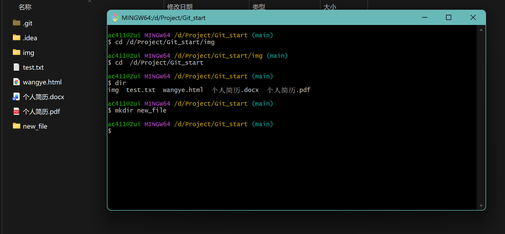
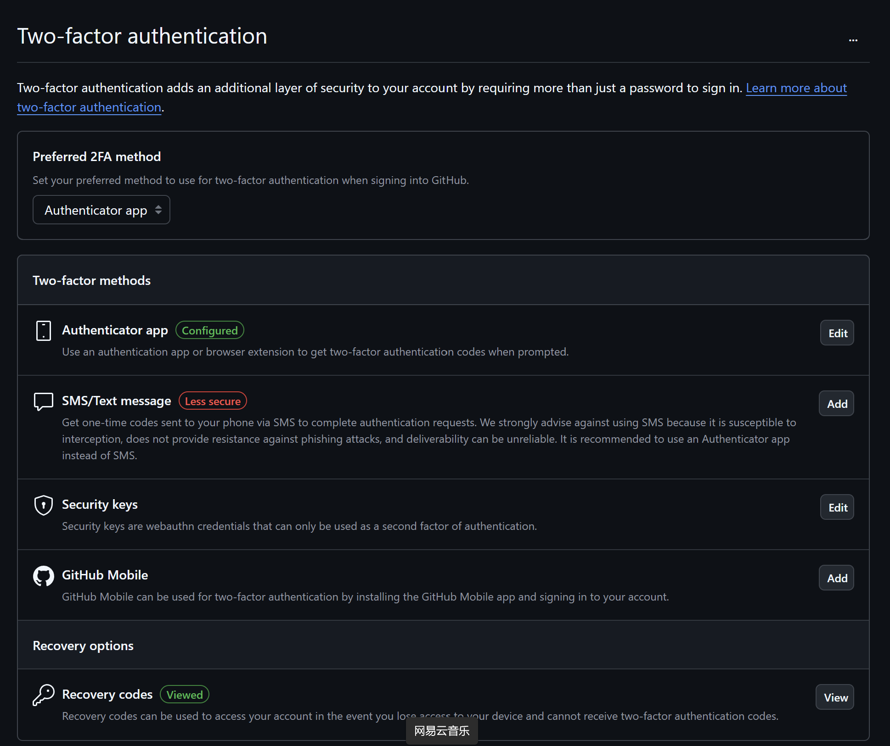
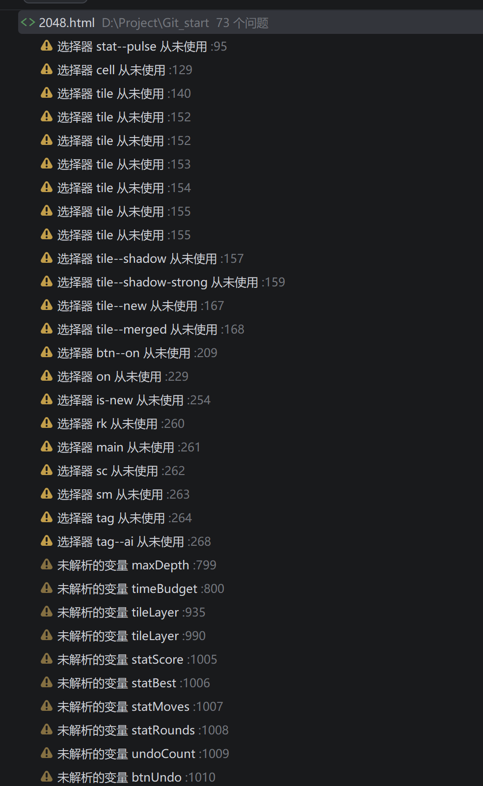
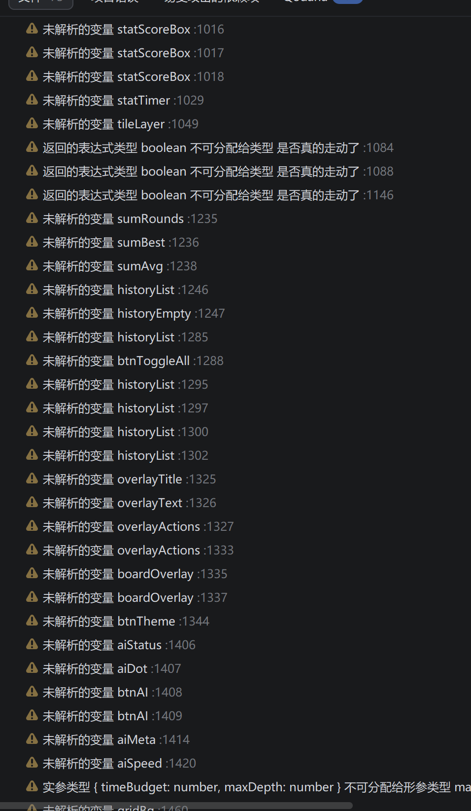

# 考核任务仓库
---
<h3>1.环境准备</h3>

Ai编程工具使用：Deepseek Harness(部分使用Codex）

代码编辑器使用：WebStorm（部分使用CLion）

<h3>2.个人简介</h3>

PDF文件版：<a href=https://github.com/Z-U-I-S/beginning/blob/main/%E4%B8%AA%E4%BA%BA%E7%AE%80%E5%8E%86.pdf>个人简介</a>

个人网站：<a href=https://github.com/Z-U-I-S/beginning/blob/main/wangye.html>个人网站</a>

<h3>3.通用素养</h3>
<ol>
  <li>对分支与合并的理解:</li>
  <ol type='I'>
    <li>分支：新建存档</li>
    <li>合并：合并（覆盖？）存档（在没有冲突的情况下）</li>
  </ol>
  <li>Git命令行用法</li>
  <ol type='I'>
    <li>cd:访问指定目录（文件夹）</li>
    <li>ls/dir:列出当前文件夹内容</li>
    <li>mkdir:创建新文件夹</li>
    图片示意：
    
    <li>git 常用命令：</li>
      <ol type="1">
        <li>git add .：将更改好的文件存入暂存区</li>
        <li>git status：查看目录未提交文件状态</li>
        <li>git commit -m '……'：提交文件至本地仓库</li>
        <li>git push：推送文件至远程仓库</li>
        <li>git switch ……：更换到另一个分支</li>
      </ol>
  </ol>
    <li>信息安全意识：</li>
    <ul>
      <li>LICENSE：为项目添加许可证，为开源项目提供法律基础、建立信任、促进协作、保障商业合规</li>
      <li>GitHub两步验证：</li>
      
      <li>查证：这个可能有点难找，目前用的模型还没遇到过，但有一些小bug是我检查后修正的，如图：</li>
      
      
      
修复后效果：

      
    </ul>
    <li>关键代码：</li>
</ol>
<h3>4.小游戏</h3>

提示词：最难受的来了，因为做这个项目的期间电脑重装了系统，但是我没有保存好API Key，所以之前输的提示词都丢失了，现在只能凭记忆复刻

第一段：请你按照以下要求，依据传统2048规则，生成一个不依赖其他框架的纯html格式的2048小游戏

要求：1.可以使用asdw或方向键操控数字方块移动方向

2.在游戏界面旁边添加游戏描述和操作介绍

3.添加AI操作功能，可以在网页端实现AI自动游玩

4.添加计时器与统计功能，计算玩家游玩时长与移动步数，将其保存到本地的历史记录

5.允许游玩时多次撤回

6.游戏界面可设置深色界面和浅色界面

第二段（发现了合出2048后界面有Bug）：在合出2048后有部分数字块显示在游戏胜利的界面上方，请你修改这部分代码，使合成出2048后弹出的胜利界面始终位于最上层；AI行动间隔太短，使AI模式运行时电脑卡顿，请你为AI模式每一步行动之间添加0.01秒的时间间隔

第三段（优化AI逻辑）：AI模式下的算法不符合主流游戏技巧，请你优化算法，使其运行时满足最大的数字保持在角落，其余数字由大到小向外分布的游戏思路

阶段1：

24~425行：游戏操作界面与设置

441~466行：计时器

475~599行：用asdw或方向键控制方块移动，合并，然后加分

阶段2：

612~662行：AI移动操作

669~876行：AI评估局面并决策操作

